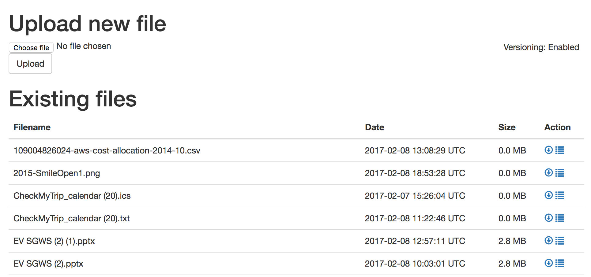

# Simple Upload Tool for S3



## Features

* Upload new files to an S3 bucket in StorageGRID
* Filter existing objects by a prefix
* Download existing objects, including older versions

## Usage

The tool can either be directly deployed on Docker or Swarm, or manually via command line.

### Dockerized
Build Docker image:
```
$ docker build -t s3uploader .
```
Run it:
```
$ docker run -d --name s3uploader \
-e AWS_ACCESS_KEY_ID=secret \
-e AWS_SECRET_ACCESS_KEY=secret \
-e S3_ENDPOINT=https://hostname:port \
-e S3_BUCKET_NAME=bucketname \
s3uploader
```

### Direct execution via CLI

Requires `sinatra shotgun haml aws-sdk`:
```
#!/bin/sh

export AWS_ACCESS_KEY_ID='supersecret'
export AWS_SECRET_ACCESS_KEY='supersecret'
export S3_ENDPOINT='https://hostname:port'
export S3_BUCKET_NAME='bucketname'

shotgun --host 0.0.0.0 --port 8080 s3uploader.rb
```
